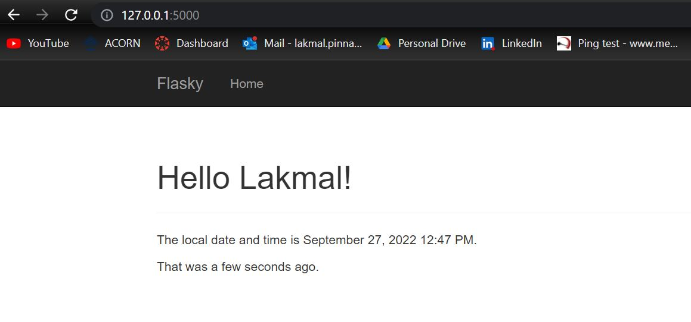

# ECE444-F2022-Lab2

Charith Pinnaduwage: this repo is a clone of https://github.com/miguelgrinberg/flasky

**Activity 1**

**Activity 2**

**Activity 3**

Commit 'Completed Example 3-1 to 3-3' to 'Completed Example 3-10 to 3-14, Completed Activity 3'

**Activity 4**

Commit 'Completed Example 4-1 to 4-7' to 'Added UofT Email form field'

